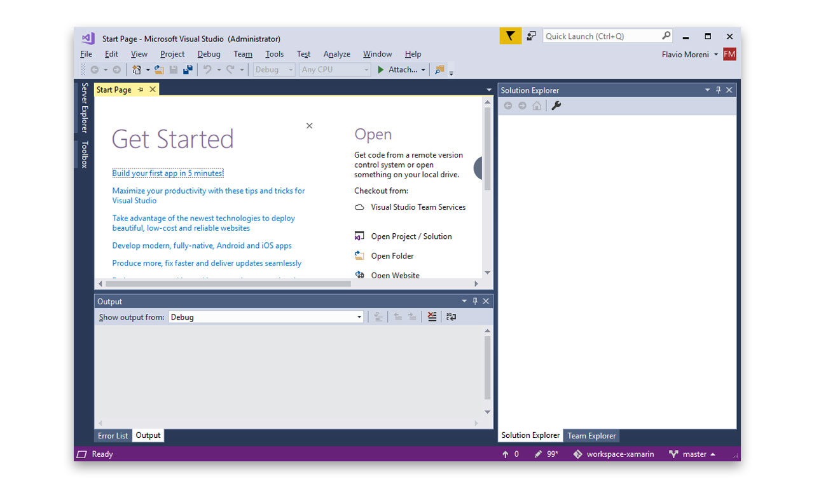
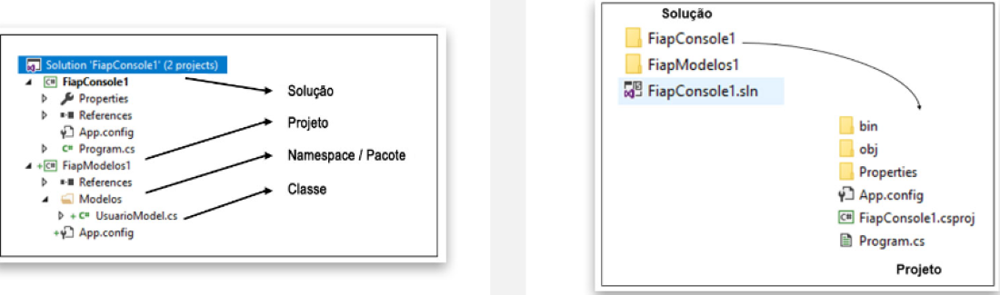
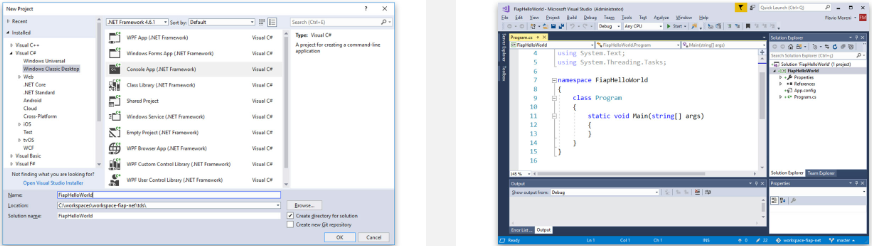

<div align="center">
<h1>Introdução à Plataforma .NET</h1>
</div>

## História

Na década de 1990, a Microsoft tinha como produto principal as linguagens Visual Basic e Visual C++, que possuíam suporte de execução apenas na plataforma Windows. No final dessa década, iniciou-se a aceitação de linguagens independentes de plataforma de execução, tendo O Java como uma das mais conhecidas e usadas.
Com O nome de Next Generation Windows Services (NGWS), a Microsoft iniciou o desenvolvimento do .NET Framework, que foi lançado na sua versão beta no final do ano de 2001. o lançamento final da versão 1 do framework aconteceu meses depois, em fevereiro de 2002.

## Criação do Csharp (C#)

Com o avanço das linguagens de programação (entre elas, o Java e o Delphi) e de dispositivos eletrônicos, as linguagens de programação foram obrigadas a criar recursos de execução para diversos dispositivos e plataformas. Como primeira estratégia, a Microsoft adotou a linguagem Java com o nome de J++, em um acordo de licenciamento com a Sun MicroSystems para o uso da linguagem na plataforma Windows. Esse acordo não foi suficiente, pois a exigência da época era executar essa linguagem em múltiplas plataformas e dispositivos.
Assim, a nova estratégia da empresa foi a criação de uma nova linguagem independente de licenciamentos e acordos, com grande foco em indepedência de plataforma e dispositivo. Essa iniciativa foi criada a partir do projeto COOL (C-like Object Oriented Lnaguage), que teve como base outras linguagens, como:

<div align="center">
  <table>
    <tr>
      <td>Java</td>
      <td>C</td>
      <td>C++</td>
    </tr>
    <tr>
      <td>Smalltalk</td>
      <td>Delphi</td>
      <td>Visual Basic (VB)</td>
    </tr>
  </table>
</div>

O projeto COOL foi renomeado para C# 1.0 (C Sharp 1.0) e lan¢ado em conjunto com o NET Framework em 2002.
Desde essa época, a linguagem passou por varias atualizacdes, a versdo mais atual € a 7.0, que teve como uma das grandes melhorias a implementacao de chamadas assincronas, além da evolucao na velocidade de execucdo de comandos.

O Framework NET é um ambiente para a execu¢do de programas de computador que fornece uma variedade de servicos aos aplicativos em execução

Seus principais componentes são:
  - CLR (Common Language Runtime), responsável por gerenciar a execução de aplicativos.
 
  - Biblioteca de classes, responsável em prover uma coleção de componentes e códigos que os desenvolvedores possam usar em seus softwares.

Em resumo, o Framework .NET é um ambiente de execução de código e bibliotecas usado por desenvolvedores para criar e executar programas. Assim como o Java e outras linguagens, utiliza do conceito de máquina virtual, que cria uma camada entre o sistema operacional e a aplicação.

O componente responsável por esse isolamento entre aplicação e sistema operacional é o CLR (Common Language Runtime).Porém,o CLR possui mais responsabilidades do que somente o isolamento entre aplicação e sistema operacional.O CLR também é responsável por:

 - Gerenciamento de memória.
 - Tipos comuns de variávels.
 - Bibliotecas para tipos exclusivos de projetos (por exemplo: projetos de internet, acesso a banco de dados, projetos de aplicativos móveis e outros).
 - Compatibilidade de versão.
 - Multiplataforma (por exemplo: Windows 7, Windows 8, Windows 8.1, Windows 10, Windows Phone e Xbox 360).
 - Execuções paralelas com diferentes versões do framework.

## Visual Studio 

O ambiente de desenvolvimento ou IDE (integrated Development Environment) do .NET Framework é chamado
de Visual Studio. E a ferramenta de suporte ao desenvolvimento das linguagens C# (C Sharp), Visual Basic NET (VB.NET), C, C++ e Xamarin.


### Produtos suportados

O Visual Studio oferece suporte a três linguagens de programação, são elas: 

  - Microsoft Visual C++.
  - Microsoft Visual C#.
  - Microsoft Visual Basic (VB.NET). 

Possui também o Microsoft Visual Web Developer, plataforma para desenvolvimento de aplicações ou serviços web, para os quais se deve usar as bibliotecas do pacote ASP.NET podendo-seescolher entre as linguagens C# ou VB.NET.

Para controlar os códigos-fonte, gerenciar o desenvolvimento e criar relatórios de produtividade, o Visual Studio oferece suporte ao Team Foundation Server (TFS).

E, por fim, 0 VS 2017 possibilita a instalação da plataforma de desenvolvimento de aplicativos móveis no formato híbrido (Android e IOS), chamado de Xamarin.Forms.

As primeiras versões do Visual Studio ofereciam suporte para as linguagens de programção Visual FoxPro e Microsoft Visual J++/J#. Tinham como ferramenta de gerenciamento de código-fonte o Visual SourceSafe e também a ferramenta Visual InterDev, para auxiliar na criaçãode aplicações Microsoft Active Server Pages (ASP).

## Projetos
### Estrutura do projeto

O espaço de trabalho para o desenvolvedor no Visual Studio é conhecido como solution, ou “solução”, em português. No sistema de arquivos do computador, toda solução é apresentada por arquivo com a extensãos s|n.
`A solução é responsável por agrupar vários projetos .NET, permitindo a navegação entre eles e a compilação de todos ao mesmo tempo.` 
O projeto .NET é o responsável pelo agrupamento do código-fonte, ícones, imagens, xml, dll e qualquer outra fonte que será compilada. No sistema de arquivo, um projeto é apresentado pela extensão .csproj (C#) ou .vbproj (VB).

Veja abaixo a estrutura da solução e projetos no Visual Studio e no sistema de arquivos do Windows:


## Criando um projeto
Para o primeiro programa, sera necessária a criação de uma solução de projeto. Com o Visual Studio aberto, selecione o menu `File > New > Project (a tecla de atalho Crtl + Shift + N)`, para abertura da tela de criação de novos projetos.

A Figura `Tela de criacdo de projeto` apresenta a tela inicial de criação de um projeto e os templates disponíveis.

Na tela de criação, devemos escolher a linguagem Visual C# na parte direita da janela. No centro, vamos selecionar o tipo de projeto Console App (.NET Framework). Na parte inferior, temos a caixa de texto para definir o nome do projeto, o local no sistema de arquivos e o nome da solução. Para nosso exemplo, vamos usar <b>FiapHelloWorld<b> como nome do projeto e da solução.

Com o projeto aberto, e por meio do Solution Explorer posicionado no lado esquerdo da janela do Visual Studio, podemos navegar para o sistema de arquivos e verificar os arquivos do projeto. Com um clique do botão direto em cima do projeto ou da solução, selecione a opção <b>Open Folder in File Explorer<b>.

### Escrevendo o código:
Anteriormente, foram executados os passos para a criação de um projeto C# do tipo Console Application, que por padrão gera a classe <b>Program.cs<b>, a qual será responsável pela <b>execução dos nossos comandos<b>. 

``` C#
using System;
namespace FiapHelloWorld
{
  class Program 
  {
    static void Main(string[] args)
    {
      
    }
  }
}
```

Agora, vamos inserir algumas linhas de código e executar o primeiro programa. Com um duplo clique no arquivo <b>Program.cs<b>, disponível na janela <b>Solutions Explorer<b>, podemos editar o conteúdo do programa e inserir as linhas de código necessárias. Assim, vamos inserir uma linha para a impressão de uma mensagem na tela e outra linha que mantém a janela para a visualização do usuário até que uma tecla seja pressionada:

``` C#
using System;
namespace FiapHelloWorld 
{
  class Program 
  {
    static void Main(string[] args)
    {
      Console.WriteLine("Fiap - Ola C#"); 
      
      Console.Read(); // trecho para manter a janela aberta
    }
  }
}
```
### Compilando e executando


