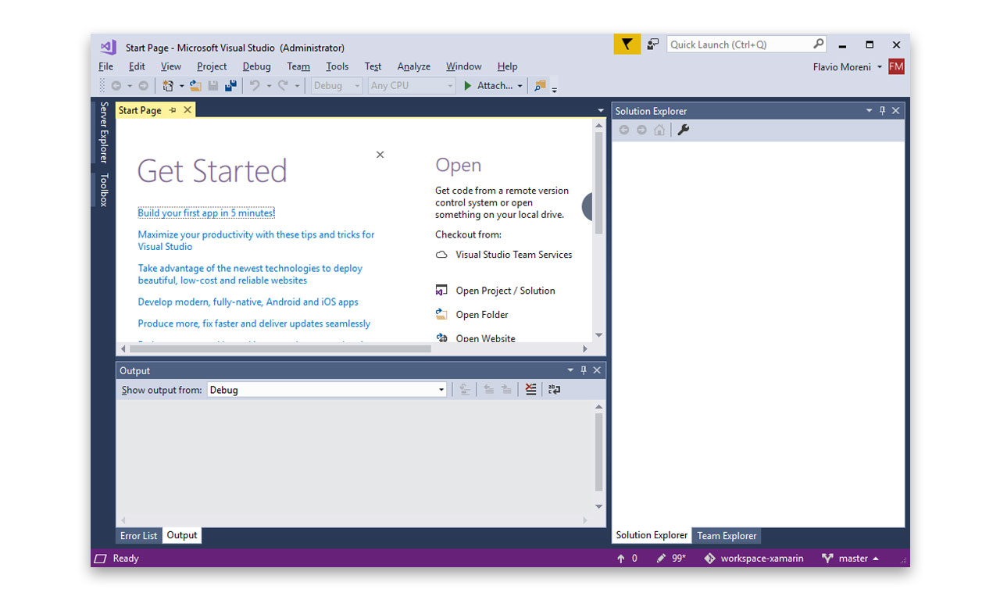

<h1>Introdução à Plataforma .NET</h1>

## História

Na década de 1990, a Microsoft tinha como produto principal as linguagens Visual Basic e Visual C++, que possuíam suporte de execução apenas na plataforma Windows. No final dessa década, iniciou-se a aceitação de linguagens independentes de plataforma de execução, tendo O Java como uma das mais conhecidas e usadas.
Com O nome de Next Generation Windows Services (NGWS), a Microsoft iniciou o desenvolvimento do .NET Framework, que foi lançado na sua versão beta no final do ano de 2001. o lançamento final da versão 1 do framework aconteceu meses depois, em fevereiro de 2002.

## CRIAÇÃO DO CSHARP (C#)

Com o avanço das linguagens de programação (entre elas, o Java e o Delphi) e de dispositivos eletrônicos, as linguagens de programação foram obrigadas a criar recursos de execução para diversos dispositivos e plataformas. Como primeira estratégia, a Microsoft adotou a linguagem Java com o nome de J++, em um acordo de licenciamento com a Sun MicroSystems para o uso da linguagem na plataforma Windows. Esse acordo não foi suficiente, pois a exigência da época era executar essa linguagem em múltiplas plataformas e dispositivos.
Assim, a nova estratégia da empresa foi a criação de uma nova linguagem independente de licenciamentos e acordos, com grande foco em indepedência de plataforma e dispositivo. Essa iniciativa foi criada a partir do projeto COOL (C-like Object Oriented Lnaguage), que teve como base outras linguagens, como:

  <table>
    <tr>
      <td>Java</td>
      <td>C</td>
      <td>C++</td>
    </tr>
    <tr>
      <td>Smalltalk</td>
      <td>Delphi</td>
      <td>Visual Basic (VB)</td>
    </tr>
  </table>

O projeto COOL foi renomeado para C# 1.0 (C Sharp 1.0) e lan¢ado em conjunto com o NET Framework em 2002.
Desde essa época, a linguagem passou por varias atualizacdes, a versdo mais atual € a 7.0, que teve como uma das grandes melhorias a implementacao de chamadas assincronas, além da evolucao na velocidade de execucdo de comandos.

© Framework NET é um ambiente para a execu¢do de programas de computador que fornece uma variedade de servicos aos aplicativos em execução

Seus principais componentes são:
  - CLR (Common Language Runtime), responsável por gerenciar a execução de aplicativos.
 
  - Biblioteca de classes, responsável em prover uma coleção de componentes e códigos que os desenvolvedores possam usar em seus softwares.

Em resumo, o Framework .NET é um ambiente de execução de código e bibliotecas usado por desenvolvedores para criar e executar programas. Assim como o Java e outras linguagens, utiliza do conceito de máquina virtual, que cria uma camada entre o sistema operacional e a aplicação.

O componente responsável por esse isolamento entre aplicação e sistema operacional é o CLR (Common Language Runtime).Porém,o CLR possui mais responsabilidades do que somente o isolamento entre aplicação e sistema operacional.O CLR também é responsável por:

 - Gerenciamento de memória.
 - Tipos comuns de variávels.
 - Bibliotecas para tipos exclusivos de projetos (por exemplo: projetos de internet, acesso a banco de dados, projetos de aplicativos móveis e outros).
 - Compatibilidade de versão.
 - Multiplataforma (por exemplo: Windows 7, Windows 8, Windows 8.1, Windows 10, Windows Phone e Xbox 360).
 - Execuções paralelas com diferentes versões do framework.

## Visual Studio 

© ambiente de desenvolvimento ou IDE (integrated Development Environment) do .NET Framework é chamado
de Visual Studio. E a ferramenta de suporte ao desenvolvimento das linguagens C# (C Sharp), Visual Basic NET (VB.NET), C, C++ e Xamarin.

